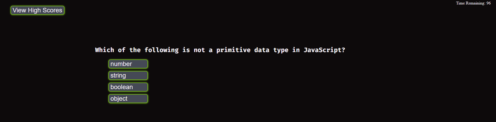
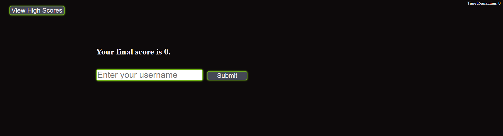
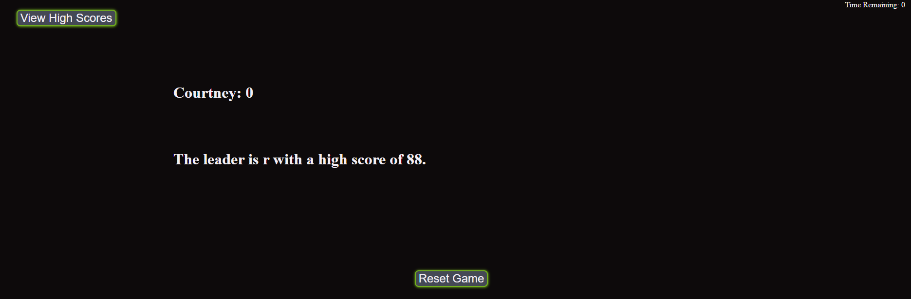

# coding-quiz-challenge

## This challenge tests the user's knowledge about JavaScript trivia and produces an end score.

In this activity, I created a coding quiz game to help the user test their knowledge of JavaScript.

This quiz has the user answer multiple choice questions. If the user correctly answers the question, another question will be provided. (There are 10 questions in all.) If the user answers the question incorrectly, the time will subtract 15 seconds and display the next question. The game will end when one of two things happen:

- when the timer reaches 0,
- when the user answers all 10 questions

The user's score will be the time, if any, remaining on the clock.

If the user has the high score for the game, that score will be saved to the local storage and presented as the high score until:

- a new high score is achieved,
- the high scores are reset

I learned valuable information from this project. It was a project with no starter sode, so I had to put the components together and make them work. The components used are:

- HTML
- CSS
- JavaScript
- asset folder
- jQuery
- classes
- id tags
- DOM traversal
- event listeners

This was a great learning challenge for me.

Instead of making multiple links and pages, I used `$("#").show();` and `$("#").hide();` to make components appear and disappear.

I continued my quest of making functions work together and call each other. This has helped my logic flow by allowing me to group smaller blocks of code and call on them when I need them. There were times when my logic was not working the way I expected it to work, so I practiced debugging my code and looking for mistakes. I am feeling very confident with this skill now.

My biggest challenge going forward is CSS concepts. I did not feel as comfortable with CSS as I would like. A debugging trick I used for this was to set a specific `
` to a bright background color so I could check margins and positions. That helped me see what I needed to fix. My goal before the next project is to familiarize myself with CSS layouts so I can feel more confident going forward.

## Installation

N/A

## Usage

## Credits

I relied on W3Schools for some help with CSS stylings and DOM inquiries.

I referenced MDN Documentation.

I used the jQuery library and documentation.

I found the multiple choice questions on this website:
https://basescripts.com/110-javascript-quiz-questions-with-solutions-pdf-download-test-your-knowledge
